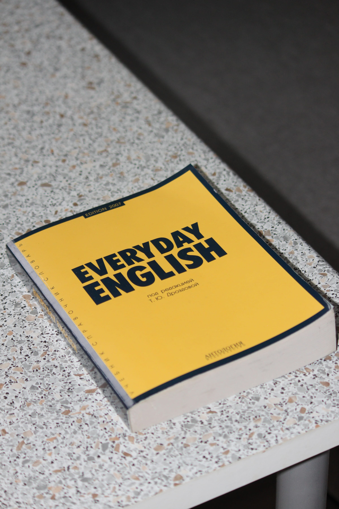

import imageAngelaFisher from '@/images/team/angela-fisher.jpg'

export const article = {
  date: '2026-04-15',
  title: 'A Short Guide to Mastering Academic Submissions',
  description:
    'As a student, the most important aspect of your journey is presenting your work. It’s not just about being accurate and original, but also about standing out in a sea of average submissions.',
  author: {
    name: 'Angela Fisher',
    role: 'Senior Academic Consultant',
    image: { src: imageAngelaFisher },
  },
}

export const metadata = {
  title: article.title,
  description: article.description,
}

## 1. Originality is Key

Time is scarce, but don’t waste it submitting generic, cookie-cutter responses. One approach to academic success is ensuring every assignment is 100% original and tailored specifically to your professor's unique prompts.

Need a complex case study? Don’t settle for "standard." At UpthriveWork, we treat every assignment as a unique artifact. By delivering plagiarism-free work on time, every time, you get the added benefit of being the student whose work sets the benchmark for the rest of the class. This is called academic leverage.

## 2. Engineer to Impress

When submitting Full Stack or AI/ML projects, it’s important that your implementation ranks high in technical depth. Professors look for more than just code that runs; they look for architecture that shows real-world readiness.

One way to stand out is to include all the cutting-edge features your peers might miss. Instead of a "BasicLogin," our Full Stack projects feature "SecureMultiFactorAuthWithCausalAnalytics," ensuring your project is returned as the "Gold Standard" during the final evaluation. We build intelligent models and data pipelines that don't just work—they impress.

## 3. Mastering the Academic Lexicon

In the world of higher education, you are often required to speak multiple "academic languages" simultaneously—from the formal tone of a dissertation to the persuasive energy of a seminar pitch.

You don't need to struggle to translate your ideas into these different formats. Whether you need a "Presentation" that wows during a viva or a "Research Paper" that meets international journal standards, our experts navigate these academic dialects for you. You’ll ace your seminar while being more inclusive of the rigorous standards demanded by global universities.

